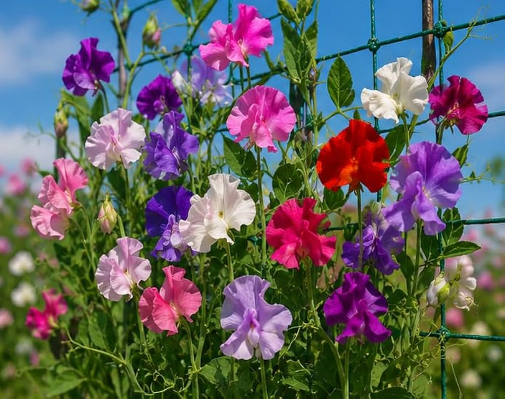

# GPU Image Stylization Pipeline

## Overview
This project processes 100 unique images using GPU-accelerated CUDA kernels to apply four artistic filters: Oil Paint, Pencil Sketch, Cartoon Effect, and Vintage Film. The images are generated from a single input image with random variations in brightness, contrast, color, and noise.

## Dataset
- **Total Images Processed:** 100 unique variations
- **Image Size:** 791 x 1000 pixels
- **Source:** Single input image (sweet.jpg) with generated variations

## Full Dataset
The complete dataset (100 input images + sample outputs from all filters) is available for download:
📦 **[Download project_artifacts.zip](https://we.tl/t-6Opis6RCfwnNT6Lq)**

## Filters Implemented

| Filter | Description |
|--------|-------------|
| Oil Paint | Smooths colors while preserving edges using neighborhood averaging |
| Pencil Sketch | Converts to grayscale with edge enhancement using Sobel operator |
| Cartoon Effect | Color quantization for cartoon look (32 levels per channel) |
| Vintage Film | Warm tones with color transformation (red boost, blue reduction) |

## Performance Results (100 images)

| Filter | GPU Avg Time (s) | CPU Avg Time (s) | Speedup |
|--------|------------------|------------------|---------|
| Oil Paint | 0.0026 | 0.0018 | 0.68x |
| Pencil Sketch | 0.0080 | 0.0077 | 0.97x |
| Cartoon Effect | 0.0025 | 0.0012 | 0.47x |
| Vintage Film | 0.0022 | 0.0106 | **4.75x** |

## One Image, Four Filters

| Original | Oil Paint | Pencil Sketch | Cartoon | Vintage |
|----------|-----------|---------------|---------|---------|
|  |  |  |  |  |

### Key Observation
GPU was **4.75x faster** for the Vintage filter, which involves complex floating-point color transformations. For simpler operations on small images (791×1000), CPU was faster due to GPU overhead. This demonstrates that GPU acceleration is most beneficial for complex operations.

## Repository Contents
- `GPU_Image_Stylization.ipynb` - Complete Colab notebook
- `performance_data.txt` - Detailed performance metrics
- `project_artifacts.zip` - 100 input images + sample outputs
- `sweet.jpg` - Original input image

## How to Run
1. Open the notebook in Google Colab
2. Enable GPU: Runtime → Change runtime type → GPU
3. Run all cells sequentially
4. 100 images will be generated and processed with 4 filters

## Requirements
- Google Colab with GPU runtime
- PyCUDA
- OpenCV
- NumPy

## Author
AJINA JOSHPIN A
## License
This project is submitted as part of the CUDA at Scale Independent Project.
